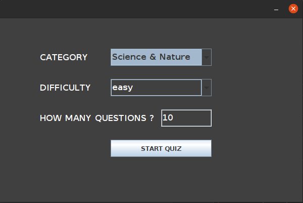
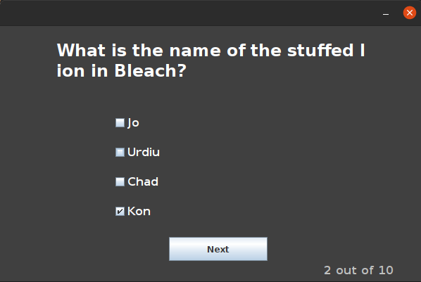

# Quiz Game - Java
A simple and complete GUI version of a quiz game created with trivabase api 
 

### Languages & tools :
[][link]
[][link]
  

| Screenshot 1 | Screenshot 2|
|------|------|
|||

### Directory Structure :
    |-- out
    |-- src
    |   |-- com
    |       |-- quizgame
    |           |-- Main.java
    |           |-- GetRawQuizData.java
    |          
    |-- QuizGame-Java.iml
    |-- quiz_data.json
    |
    |-- Img
    |   |-- intellij.png
    |   |-- java.png
    |   |-- quiGame1.png
    |   |-- quiGame2.png
    |
    |-- README.md

## JSON Processing in Java 
The Java API for JSON Processing JSON.simple is a simple Java library that allow parse, generate, transform, and query JSON.

## Getting Started
You need to download the [json-simple-1.1](http://www.java2s.com/Code/Jar/j/Downloadjsonsimple11jar.htm) jar and put it in your CLASSPATH before compiling and running the application.

### Eclipse: 

    put the json-simple-1.1.jar file in the References Libraries directory, manually or by using the 'add jars' button.
[more info](https://stackoverflow.com/questions/3280353/how-to-import-a-jar-in-eclipse)

### Intellij:

    put the json-simple-1.1.jar file in the External Libraries directory.

[link]: https://github.com/Ncas-CS

